<p align="center">
  <picture>
    
  </picture>
</p>

<h1 align="center">Rys</h1>

<p align="center">
  <strong>Your job search, unified.</strong><br/>
  One keyboard-first workspace for applications, resumes, interviews, and your network —<br/>
  with AI that helps you land the offer.
</p>

<p align="center">
  <a href="https://rys-app-production.up.railway.app">Live demo</a>
  ·
  <a href="#-quick-start">Quick start</a>
  ·
  <a href="#-architecture">Architecture</a>
  ·
  <a href="#-roadmap">Roadmap</a>
  ·
  <a href="https://github.com/me-adityaraj8/rys/issues/new">Report a bug</a>
</p>

<p align="center">
  <a href="LICENSE"></a>
  
  
  
  
  
  
</p>

<br/>

<p align="center">
  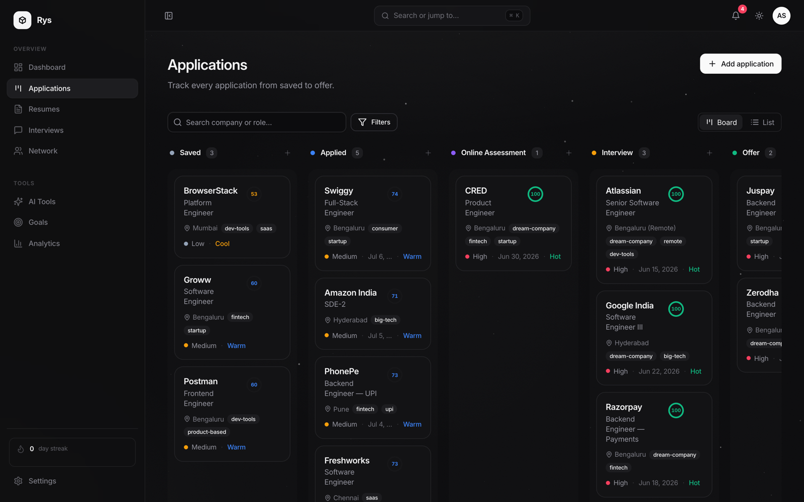
</p>
<p align="center"><sub>The board — six stages from saved to offer, drag-and-drop, opportunity scores on every card.</sub></p>

<p align="center">
  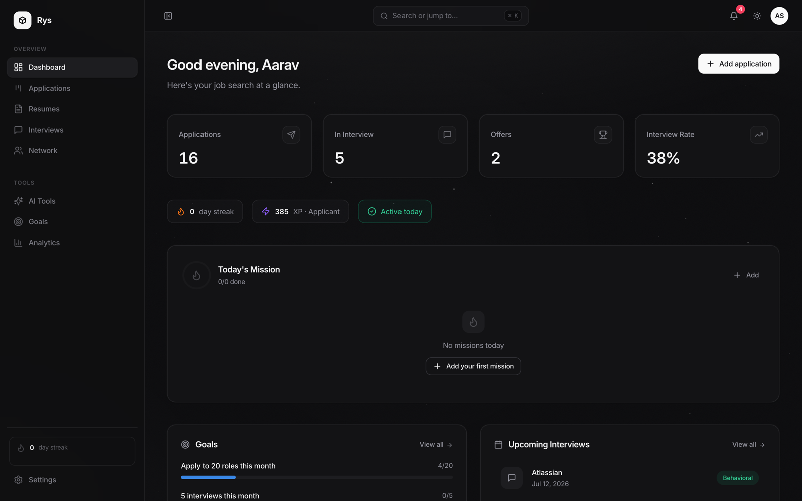
  &nbsp;
  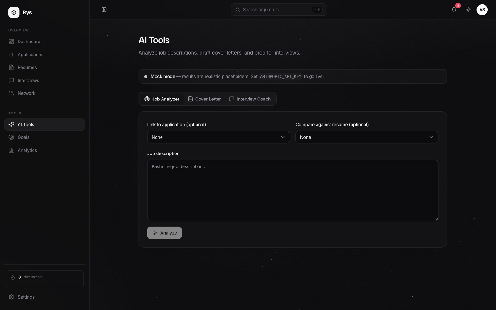
</p>
<p align="center"><sub>Dashboard with live stats, streaks, and daily missions · the AI job analyzer with a resume-match score.</sub></p>

---

## Table of Contents

- [Why Rys](#why-rys)
- [Features](#-features)
- [Tech Stack](#-tech-stack)
- [Quick Start](#-quick-start)
- [Environment Variables](#-environment-variables)
- [Project Structure](#-project-structure)
- [Architecture](#-architecture)
  - [System overview](#system-overview)
  - [Request lifecycle](#request-lifecycle)
  - [Authentication flow](#authentication-flow)
  - [State management](#state-management)
  - [Kanban state machine](#kanban-state-machine)
  - [Database schema](#database-schema)
- [API Reference](#-api-reference)
- [AI Configuration](#-ai-configuration)
- [User Journey](#-user-journey)
- [Deployment](#-deployment)
- [Performance & Scalability](#-performance--scalability)
- [Security](#-security)
- [Testing](#-testing)
- [Roadmap](#-roadmap)
- [Contributing](#-contributing)
- [License](#-license)

---

## Why Rys

A serious job search generates a surprising amount of state: which resume went to which company, who referred you where, what the recruiter said three weeks ago, when the follow-up is due, and how your funnel is actually converting. Most people manage this in a spreadsheet until the spreadsheet collapses under its own weight.

Rys replaces that spreadsheet with a purpose-built workspace:

- **A pipeline, not a list.** Applications move through a six-stage Kanban board with drag-and-drop that persists atomically — no lost cards, no stale state.
- **Context lives on the card.** Salary, location, tags, notes, the exact resume version you sent, and every interview round are one click away.
- **AI where it earns its keep.** Paste a job description and get ATS keywords, a resume match score, a tailored cover letter draft, and role-specific interview prep — powered by Claude, with a deterministic mock mode for development.
- **Momentum is a feature.** Goals, streaks, daily missions, and a conversion funnel keep the search moving when motivation dips.

Everything is keyboard-first (`⌘K` command palette, `g`-prefixed navigation), themed for light and dark, and free during early access.

---

## ✨ Features

| | Feature | Description |
|---|---------|-------------|
| 📋 | **Kanban board** | Six-stage drag-and-drop tracker (saved → applied → OA → interview → offer / rejected) with atomic reordering, search, smart filters, and a list view |
| ⚡ | **One-click job import** | Paste a job URL from Greenhouse, Lever, Ashby, SmartRecruiters, Workday, or most career pages and the application fills itself — company, role, location, salary, employment type, skills (→ tags), description, and deadline — with graceful fallbacks for sites that block automated import |
| 📄 | **Resume manager** | Upload multiple PDF versions, tag them, set a default, and link each application to the exact version you sent — with per-version performance (sent → interview rate) computed from your live pipeline |
| 🎤 | **Interview prep** | Track rounds per application — type, schedule, outcome, prep notes, and feedback |
| 🤝 | **Networking CRM** | Recruiters, referrals, alumni, and mentors with relationship context, last-contact dates, and follow-up flags |
| 🤖 | **AI tools** | Job analyzer (ATS keywords + skill match), cover letter generator, and interview coach — Claude-powered with a mock fallback |
| 📊 | **Analytics** | Applications-per-week trends, conversion funnel, response/interview/offer rates |
| 🎯 | **Goals & streaks** | Weekly/monthly targets computed from live data, XP, daily missions, and streak tracking |
| ⌨️ | **Command palette** | `⌘K` to jump anywhere, create applications, or search — plus `g d`/`g a`-style shortcuts throughout |
| 🌙 | **Dark mode** | System-aware theme with a view-transition ripple toggle, persisted per account |
| 🔒 | **Read-only demo** | One-click demo login with realistic seeded data; a server-side guard keeps the demo account immutable |

---

## 🔧 Tech Stack

| Layer | Technologies |
|-------|-------------|
| **Frontend** | React 18, Vite 5, TypeScript, Tailwind CSS, Framer Motion, dnd-kit, Radix UI, TanStack Query, Zustand, React Router, Recharts, Lucide |
| **Backend** | Node.js 22, Express 4, TypeScript, Zod, JWT + bcrypt, Multer |
| **Database** | PostgreSQL 16 — raw SQL, forward-only migrations, no ORM |
| **AI** | Anthropic SDK (Claude) with a deterministic mock mode |
| **Infra** | Docker Compose for local dev, single-container Railway deploy, multi-stage Dockerfile |

The no-ORM choice is deliberate: the data layer is a thin module of typed, parameterized SQL per feature, which keeps queries inspectable and makes the migration story trivial.

---

## 🚀 Quick Start

### Prerequisites

- **Docker** (recommended), or Node.js 22+ with PostgreSQL 13+
- Git

### Option A — Docker (recommended)

```bash
git clone https://github.com/me-adityaraj8/rys.git
cd rys

cp backend/.env.example backend/.env
cp frontend/.env.example frontend/.env

# Postgres + backend + frontend
docker compose up --build

# In another terminal — run migrations and seed the demo account
docker compose exec backend npm run migrate
docker compose exec backend npm run seed
```

Frontend: `http://localhost:5173` · API: `http://localhost:4000/api/v1`

> **macOS note:** Docker bind mounts don't propagate file-watch events, so the backend's `tsx watch` won't pick up route changes automatically — run `docker compose restart backend` after editing backend files.

### Option B — Local processes

```bash
# Backend
cd backend
cp .env.example .env           # point DATABASE_URL at your Postgres
npm install
npm run migrate
npm run seed
npm run dev                    # → http://localhost:4000

# Frontend (second terminal)
cd frontend
cp .env.example .env
npm install
npm run dev                    # → http://localhost:5173
```

### Demo login

Use the **“Try with demo account”** button on the login page, or sign in manually:

| Field | Value |
|-------|-------|
| Email | `demo@rys.app` |
| Password | `password123` |

The demo account is **read-only** — a backend guard rejects every write so shared demo data stays pristine. Sign up to get a full workspace.

---

## 🔐 Environment Variables

### Backend (`backend/.env`)

| Variable | Required | Default | Description |
|----------|----------|---------|-------------|
| `DATABASE_URL` | Yes | — | PostgreSQL connection string |
| `JWT_SECRET` | Yes | `dev_jwt_secret_change_me` | Secret for signing JWTs — change it in production |
| `JWT_EXPIRES_IN` | No | `7d` | Token lifetime |
| `ANTHROPIC_API_KEY` | No | — | Anthropic API key; leave blank for mock mode |
| `ANTHROPIC_MODEL` | No | `claude-opus-4-8` | Claude model ID |
| `CORS_ORIGIN` | No | `http://localhost:5173` | Allowed frontend origin (enforced in production) |
| `UPLOAD_DIR` | No | `uploads` | Resume PDF storage directory |
| `PORT` | No | `4000` | Server port |
| `NODE_ENV` | No | `development` | Environment mode |

### Frontend (`frontend/.env`)

| Variable | Required | Default | Description |
|----------|----------|---------|-------------|
| `VITE_API_URL` | No | `http://localhost:4000/api/v1` | API base URL (`/api/v1` in the production container) |
| `VITE_UMAMI_SRC` | No | — | Umami tracking script URL. Leave unset to disable analytics entirely |
| `VITE_UMAMI_WEBSITE_ID` | No | — | Umami website ID. Both this and `VITE_UMAMI_SRC` must be set for tracking to load |

Rys ships with optional [Umami](https://umami.is) page-view tracking — cookieless and privacy-friendly, no consent banner required. It's a no-op unless both variables above are set, so local dev, forks, and preview builds stay untracked by default. Self-host Umami (a [Railway template](https://railway.app/template/umami) exists) or use their hosted cloud, then point these two variables at it.

---

## 📁 Project Structure

```
rys/
├── Dockerfile                  # Production multi-stage build (frontend + backend in one image)
├── docker-compose.yml          # Local dev stack: Postgres 16 + backend + frontend
├── backend/
│   ├── migrations/             # Forward-only SQL, 001_init → 006_missions
│   └── src/
│       ├── config/             # Env parsing & validation (fail fast on boot)
│       ├── db/                 # pg pool, migration runner, demo seed
│       ├── routes/             # Express routers — thin, one per feature
│       ├── controllers/        # Request/response mapping, no business logic
│       ├── services/           # Business logic (auth, AI, analytics, reorder…)
│       ├── data/               # Typed raw-SQL queries, one module per table
│       ├── validation/         # Zod schemas per feature
│       ├── middleware/         # requireAuth, demoGuard, validate, errorHandler
│       └── types/              # Shared domain types
└── frontend/
    └── src/
        ├── pages/              # Route-level components (lazy-loaded)
        ├── components/
        │   ├── ui/             # Base primitives (button, dialog, select…)
        │   ├── applications/   # KanbanBoard, cards, detail modal
        │   ├── goals/ missions/ network/ resumes/ interviews/
        │   └── layout/         # Sidebar, AppLayout, top bar
        ├── hooks/              # TanStack Query hooks, one module per feature
        ├── stores/             # Zustand: auth, theme, toasts
        ├── lib/                # API client, utils, constants, gamification math
        └── types/              # API types (mirrors backend)
```

The dependency direction is strict on both sides:

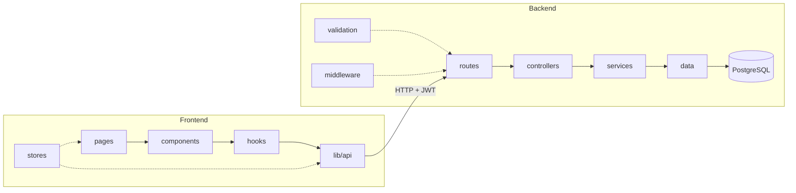

Routes never touch the database; components never call axios directly. Every feature follows the same path — the reason a REST surface of forty-odd endpoints across a dozen pages stays navigable.

---

## 🏗 Architecture

### System overview

Rys is a classic three-tier app with an optional AI sidecar. In production, one container serves both the static frontend and the API.

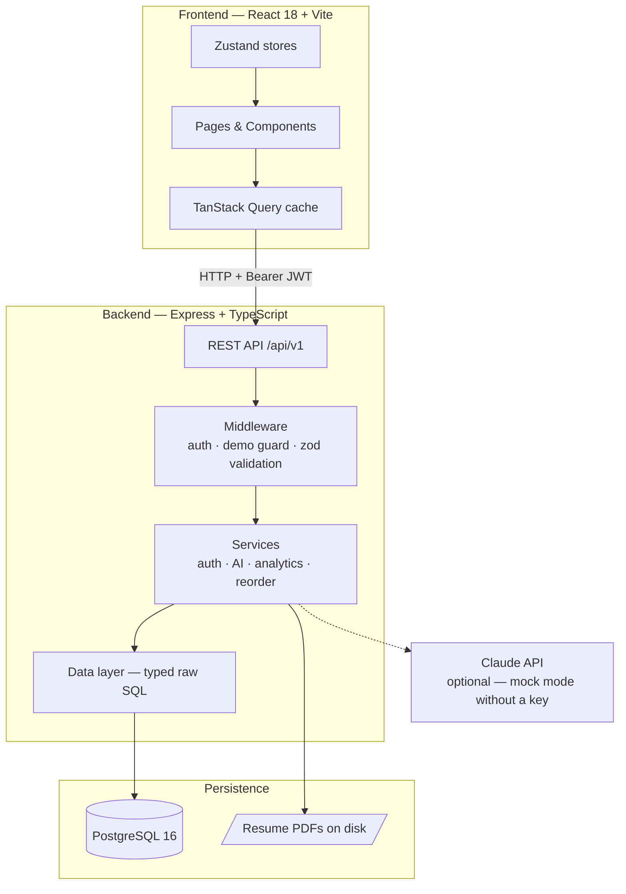

### Request lifecycle

Every request passes through the same gauntlet. Errors at any layer normalize to a single JSON envelope: `{ error: { code, message, details? } }`.

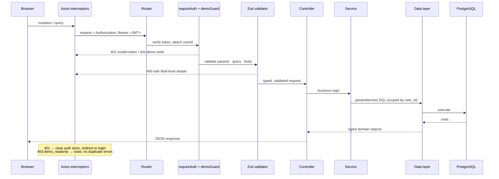

### Authentication flow

Stateless JWT auth. Passwords are hashed with bcrypt; tokens live in a persisted Zustand store and ride along on every request via an axios interceptor.

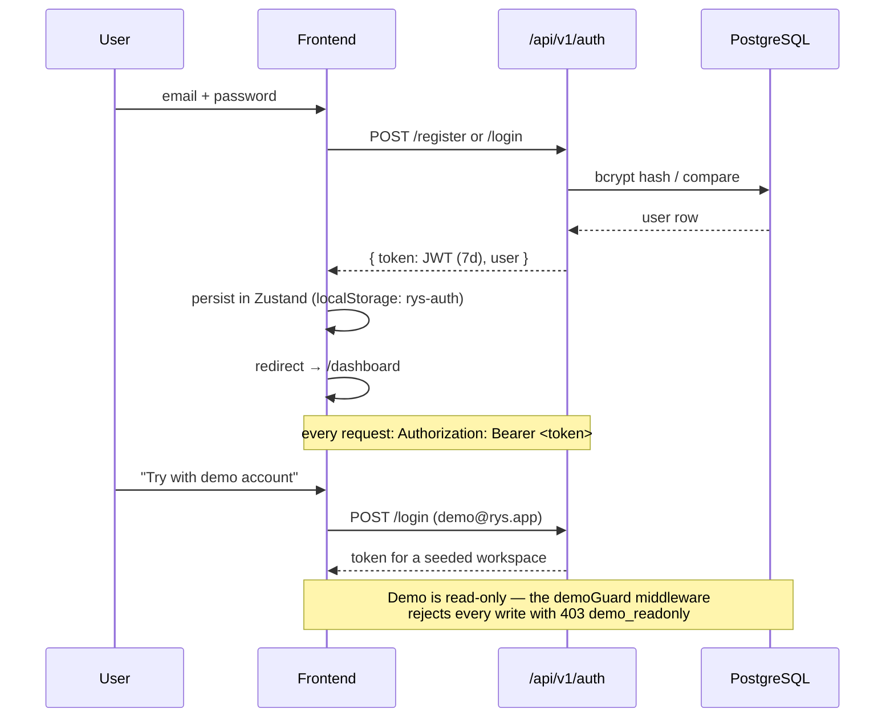

On any `401`, the axios response interceptor clears the store and the route guard bounces to `/login` — expired tokens never leave the app in a half-authenticated limbo.

### State management

Two kinds of state, two tools, no overlap:

| State | Tool | Notes |
|-------|------|-------|
| **Server state** (applications, contacts, goals…) | TanStack Query | One hook module per feature; optimistic updates with rollback for mutations; the reorder mutation trusts the server's authoritative response over the cache |
| **Client state** (auth token, theme, toasts) | Zustand | `rys-auth` and `rys-theme` persist to localStorage; toasts are ephemeral |

There is no global app store. Pages compose hooks; hooks own their cache keys; invalidation happens next to the mutation that caused it.

### Kanban state machine

An application's `stage` is a free state machine — any stage can move to any other, because real job searches are messy (an offer can be rescinded; a rejection can be revived by a recruiter).

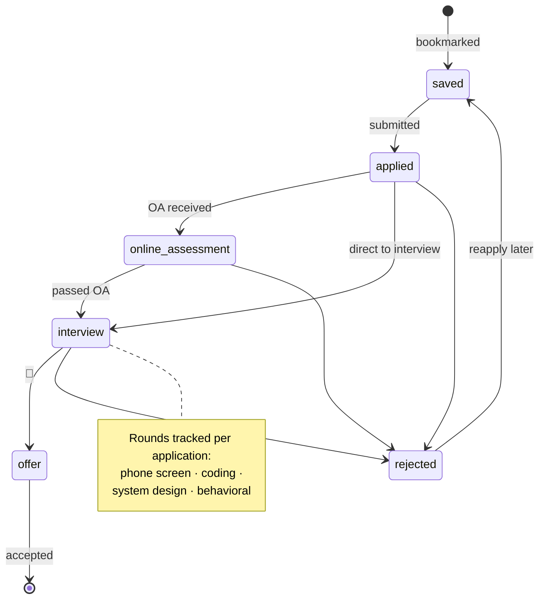

Drag-and-drop persistence is atomic. Dropping a card sends the full changed set to `PATCH /applications/reorder`; the service locks the affected rows (`SELECT … FOR UPDATE` inside a transaction), verifies ownership, renumbers positions to a clean `0..n`, and returns the authoritative list. Concurrent drags can't interleave into a corrupted board.

### Database schema

Six migrations, eleven tables, every row scoped to a user. Constraints are `CHECK`-based rather than native enums so allowed values can evolve without `ALTER TYPE` friction. A shared trigger bumps `updated_at` on every update.

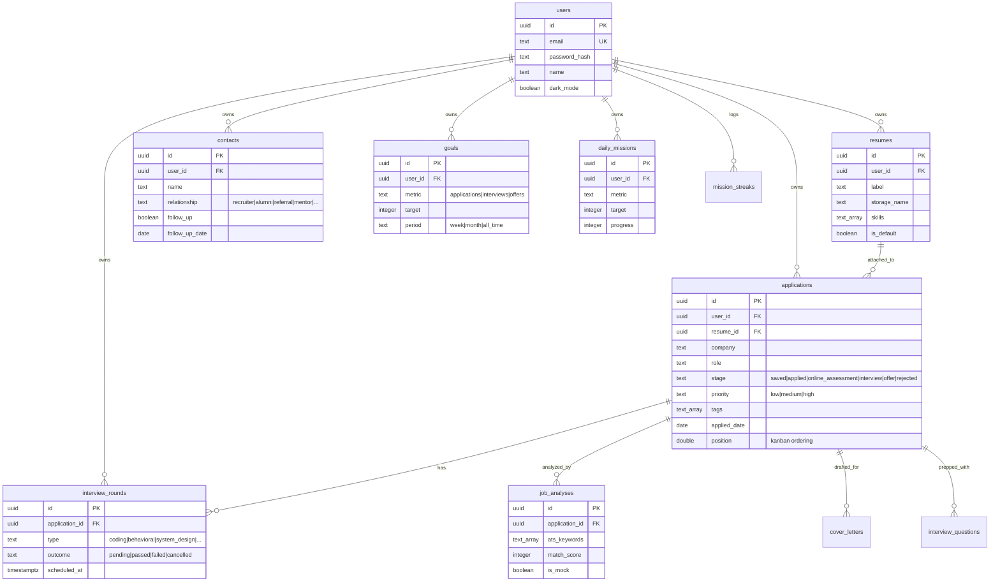

Goal progress is never stored — it's computed live from application/interview data, so goals can't drift out of sync with reality.

---

## 📡 API Reference

All endpoints are prefixed with `/api/v1`. Protected routes require `Authorization: Bearer <token>`. Write methods on the demo account return `403 demo_readonly`.

| Method | Endpoint | Auth | Description |
|--------|----------|------|-------------|
| `GET` | `/health` | — | Health check + AI mode |
| `POST` | `/auth/register` | — | Create account |
| `POST` | `/auth/login` | — | Authenticate, receive JWT |
| `GET` / `PATCH` | `/auth/me` | ✅ | Read / update profile (name, dark mode) |
| `GET` / `POST` | `/applications` | ✅ | List / create applications |
| `PATCH` / `DELETE` | `/applications/:id` | ✅ | Update / delete one |
| `PATCH` | `/applications/reorder` | ✅ | Atomic Kanban reorder (stage + position batch) |
| `GET` | `/applications/import-preview` | ✅ | Parse a job posting URL (ATS API, JSON-LD, or fallback) into pre-filled fields |
| `GET` | `/applications/tags` | ✅ | Distinct tag list |
| `GET` / `POST` | `/resumes` | ✅ | List / upload (PDF, multipart) |
| `PATCH` / `DELETE` | `/resumes/:id` | ✅ | Update metadata / delete |
| `POST` | `/resumes/:id/default` | ✅ | Set default resume |
| `GET` | `/resumes/:id/download` | ✅ | Download the PDF |
| `GET` / `POST` | `/interviews` | ✅ | List / create rounds |
| `PATCH` / `DELETE` | `/interviews/:id` | ✅ | Update / delete a round |
| `GET` / `POST` | `/contacts` | ✅ | List / create contacts |
| `PATCH` / `DELETE` | `/contacts/:id` | ✅ | Update / delete a contact |
| `POST` | `/ai/analyze-job` | ✅ | ATS keywords, skills, match score |
| `POST` | `/ai/cover-letter` | ✅ | Generate a cover letter draft |
| `POST` | `/ai/interview-questions` | ✅ | Role-specific prep questions |
| `GET` | `/ai/analyses` · `/ai/cover-letters` · `/ai/interview-questions` | ✅ | History per tool |
| `GET` | `/analytics/summary` | ✅ | Funnel, rates, weekly trends |
| `GET` / `POST` | `/goals` | ✅ | List (with live progress) / create |
| `PATCH` / `DELETE` | `/goals/:id` | ✅ | Update / delete a goal |
| `GET` / `POST` | `/missions` | ✅ | Today's missions + streak / create |
| `PATCH` / `DELETE` | `/missions/:id` | ✅ | Update / delete a mission |
| `PUT` | `/missions/reorder` | ✅ | Reorder today's missions |
| `GET` | `/missions/streak` | ✅ | Streak info + history |

---

## 🤖 AI Configuration

Two modes, switched by the presence of `ANTHROPIC_API_KEY`:

| Mode | When | Behavior |
|------|------|----------|
| **Mock** | Key is empty | Deterministic, realistic placeholder responses — labeled as mock in the UI and stored with `is_mock = true`. Zero cost, works offline. |
| **Live** | Key is set | Real Claude calls for job analysis, cover letters, and interview prep. |

The resume **match score is always computed deterministically in code** (`computeMatchScore`) regardless of mode — it's an explainable overlap metric, not model output, so it never hallucinates.

`GET /health` reports the active mode:

```json
{
  "status": "ok",
  "aiMode": "mock",
  "model": "claude-opus-4-8",
  "time": "2026-07-10T12:00:00.000Z"
}
```

---

## 🔗 Job Import

Paste a job URL and Rys pre-fills the application. The importer (`backend/src/services/jobImport/`) resolves a URL through three tiers, in order:

1. **First-class ATS APIs** — for boards with clean public JSON, we call the official endpoint directly: **Greenhouse, Lever, Ashby, SmartRecruiters, Workday**. Most reliable and complete.
2. **Generic JSON-LD** — for any other page, we fetch the HTML and extract the [schema.org `JobPosting`](https://schema.org/JobPosting) structured data that boards and career pages embed for SEO (the same data Google Jobs reads). This covers a long tail of company career pages and boards without a bespoke integration.
3. **Graceful fallback** — if a site blocks automated requests (LinkedIn, Indeed, Glassdoor, and some client-rendered Indian boards) or has no structured data, the import never dead-ends: it pre-fills the URL and a domain-inferred company with a note on what to finish manually.

Extracted fields: company, role, location, salary, employment type, skills (mapped to tags), description, deadline, and the original URL.

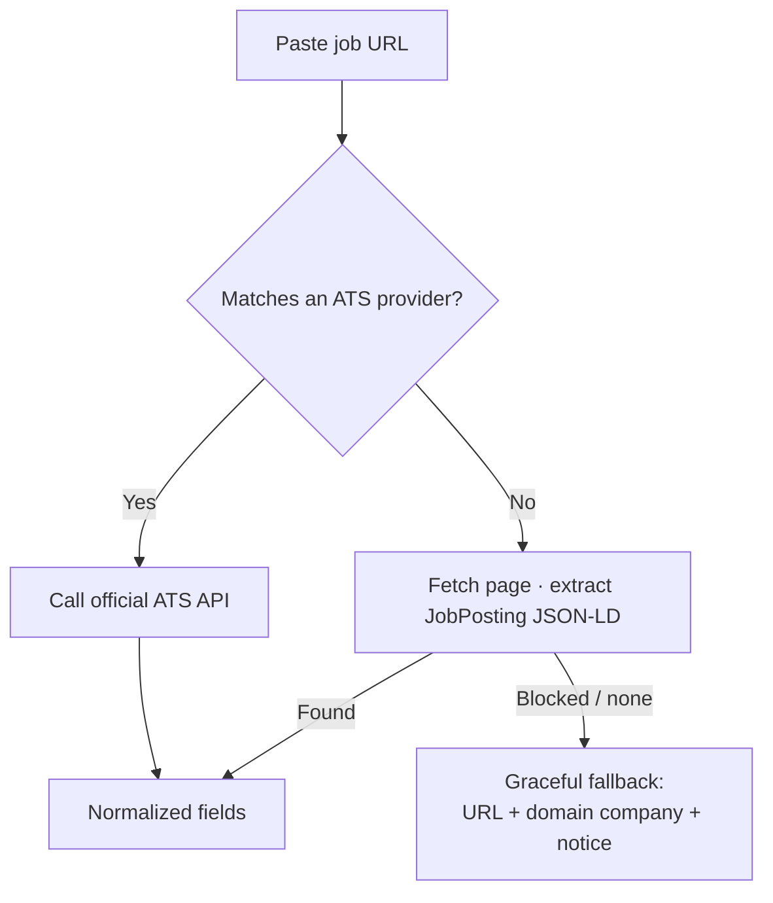

**Adding a provider** is a drop-in: implement the `Provider` interface (`match(url)` + `parse(url)`) in `providers/` and register it in `jobImport/index.ts`. Nothing else changes.

**Safety:** arbitrary user URLs (the JSON-LD path) are fetched behind an SSRF guard — https-only, DNS-resolved and rejected if they point at private/loopback/link-local/metadata addresses, with per-hop revalidation on redirects, an 8s timeout, and a response-size cap.

---

## 🧭 User Journey

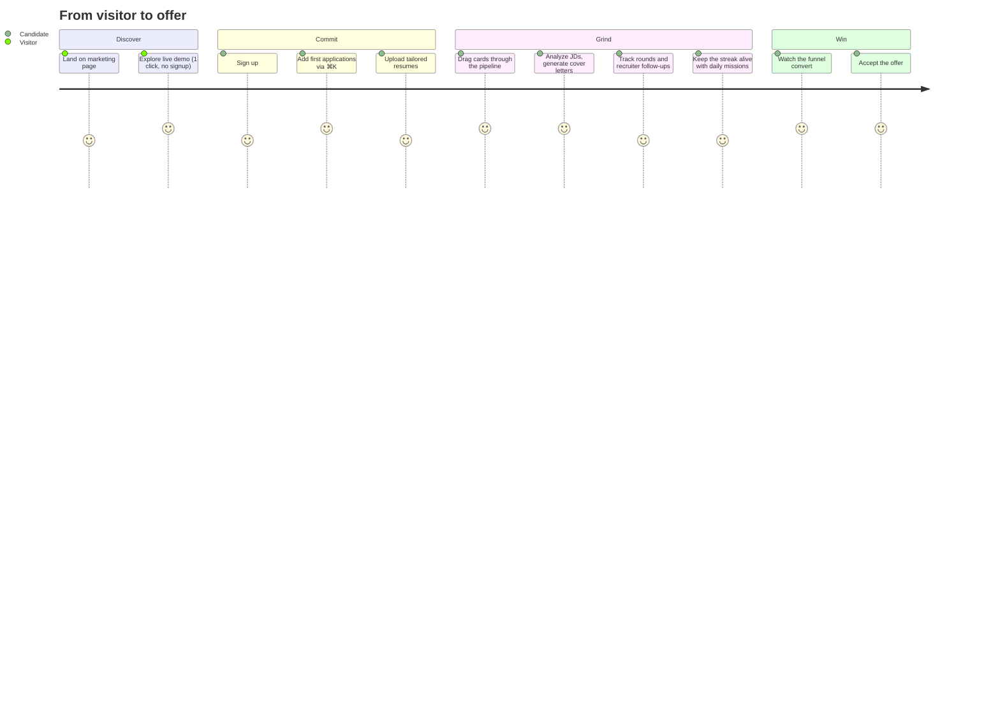

The unauthenticated root (`/`) serves the marketing page; authenticated users are routed straight to `/dashboard`. The demo CTA logs into the seeded workspace in one click.

---

## 🚢 Deployment

Rys ships as a single container: a multi-stage Dockerfile builds the Vite frontend and compiled backend, and Express serves the static bundle alongside the API. Migrations and the demo seed run automatically on boot.

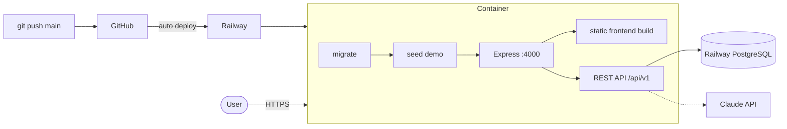

### Deploy your own

1. Fork this repo
2. Create a [Railway](https://railway.app) project and add a **PostgreSQL** database
3. Add a **service** linked to your fork — Railway detects the root `Dockerfile`
4. Set `DATABASE_URL` (reference the Railway DB), `JWT_SECRET`, and `NODE_ENV=production`; optionally `ANTHROPIC_API_KEY`
5. Push to `main` — every push deploys, migrates, and reseeds the demo

Nothing in the image is Railway-specific; any host that runs a container next to Postgres (Fly.io, Render, a VPS) works the same way.

---

## ⚡ Performance & Scalability

- **Code-split by route.** Every page is `React.lazy`-loaded behind a suspense boundary in the layout.
- **Vendor chunking.** React, data, motion, chart, and dnd libraries are split into long-cached chunks; the app shell is ~54 kB gzipped, and Recharts (~103 kB) loads only on routes that chart.
- **Optimistic UI.** Mutations update the TanStack Query cache immediately and roll back on failure; drag-and-drop feels local while persistence happens in the background.
- **Indexed access paths.** Every table is indexed on `user_id` (and `(user_id, stage)` for the board query). All queries are scoped to the authenticated user, so working sets stay small as the user base grows.
- **Row-locked reordering.** The reorder transaction locks only the rows it touches — board writes scale with board size, not table size.
- **Stateless API.** JWT auth means horizontal scaling is a replica count away; the only sticky state is uploaded PDFs (`UPLOAD_DIR`), which maps cleanly to a volume or object storage.

## 🛡 Security

- **Password storage:** bcrypt with per-user salts; emails unique case-insensitively.
- **Transport of identity:** short-form JWTs (7-day default), verified on every request; invalid tokens clear client state immediately.
- **Input validation:** every body, param, and query is parsed by a Zod schema before reaching a controller — unknown fields don't survive.
- **SQL injection:** all queries are parameterized; there is no string-built SQL anywhere in the data layer.
- **Tenant isolation:** every query filters by the authenticated `user_id`; ownership is re-verified inside multi-row transactions (e.g. reorder).
- **Demo hardening:** a dedicated middleware rejects all non-GET requests from the demo account with `403 demo_readonly`.
- **CORS:** locked to the configured origin in production; permissive only for localhost in development.
- **Uploads:** restricted to PDF mime types via Multer, stored outside the web root, served through an auth-checked download route.

Found a vulnerability? Please open a private security advisory rather than a public issue.

## 🧪 Testing

Backend business logic is unit-tested with **Vitest** — auth (hashing, JWT issue/verify, error paths), the resume match scorer, and analytics calculations:

```bash
cd backend && npm test
```

Type safety is enforced end-to-end; both projects compile with strict settings and `noUnusedLocals`:

```bash
cd backend && npm run typecheck
cd frontend && npm run typecheck
```

### Scripts

| Command | Backend | Frontend |
|---------|---------|----------|
| `npm run dev` | Hot-reload API (tsx watch) | Vite dev server with HMR |
| `npm run build` | Compile to `dist/` | Type-check + production bundle |
| `npm start` / `preview` | Run compiled server | Preview the production build |
| `npm run migrate` | Apply pending SQL migrations | — |
| `npm run seed` | Reseed the demo account | — |
| `npm test` | Vitest unit tests | — |
| `npm run typecheck` | `tsc --noEmit` | `tsc --noEmit` |

---

## 🗺 Roadmap

Near-term, roughly in order:

- [ ] **Email & calendar integrations** — capture applications from your inbox, sync interview schedules
- [ ] **Notification digests** — follow-up and interview reminders by email, not just in-app
- [ ] **Browser extension** — one-click capture from LinkedIn/job boards into the Saved column
- [ ] **Shared boards** — read-only board links for coaches, mentors, and placement cells
- [ ] **Advanced AI** — longer-context analysis across your whole pipeline, offer-comparison assistant
- [ ] **Mobile-first pass** — the layout is responsive today; a dedicated mobile experience is next

Have an idea? [Open a discussion](https://github.com/me-adityaraj8/rys/issues) — roadmap items get promoted from real usage, not guesses.

---

## 🤝 Contributing

Contributions are welcome. The codebase is deliberately boring in the best way — one pattern per layer, no magic.

1. **Fork** and clone: `git clone https://github.com/<you>/rys.git`
2. **Branch:** `git checkout -b feature/your-feature`
3. **Develop** against the Docker stack (`docker compose up`)
4. **Verify:** `npm test` and `npm run typecheck` in both `backend/` and `frontend/`
5. **Open a PR** — keep it focused, one change per PR

House rules:

- Follow the existing layer boundaries (routes → controllers → services → data; pages → components → hooks → api)
- New business logic gets a unit test; new endpoints get a Zod schema
- Match the existing naming and comment style — comments explain *why*, not *what*

---

## 📄 License

Released under the [MIT License](LICENSE).

---

<p align="center">
  Built with ☕ and TypeScript
</p>
