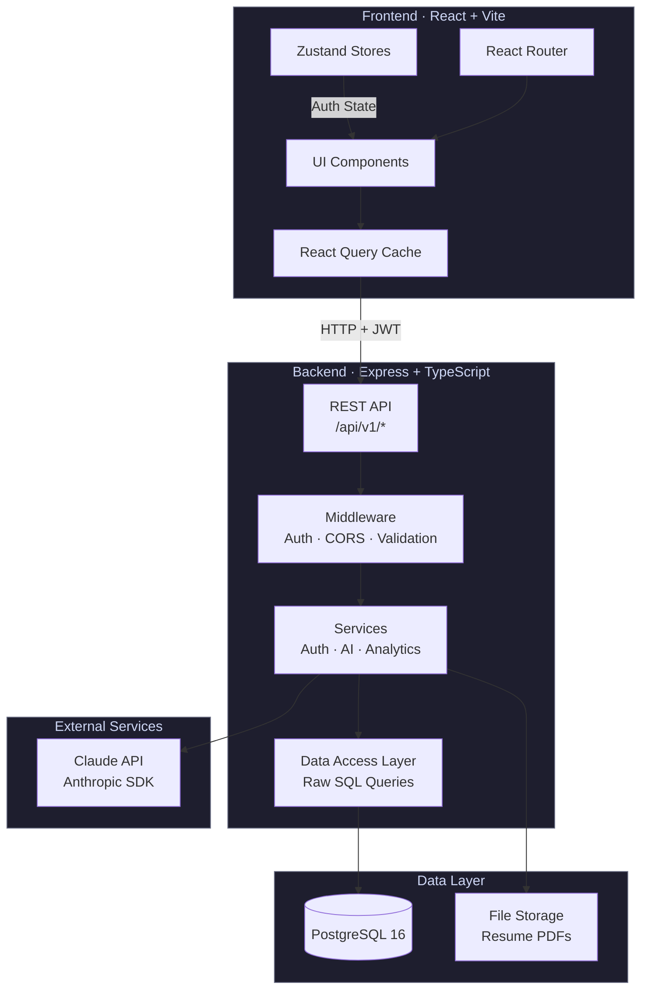
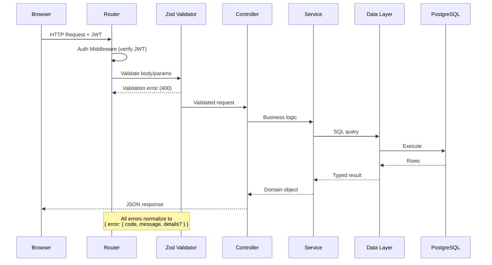
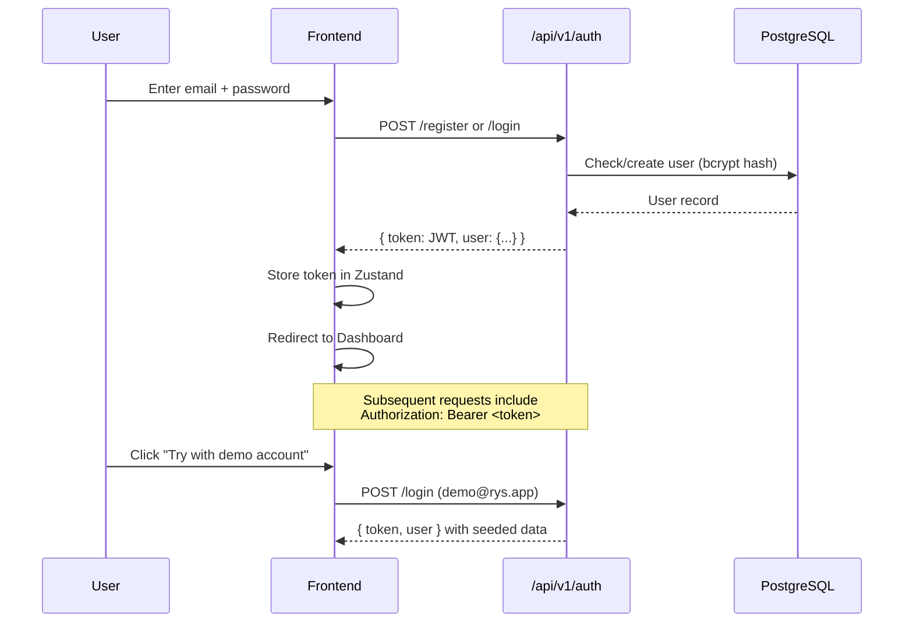
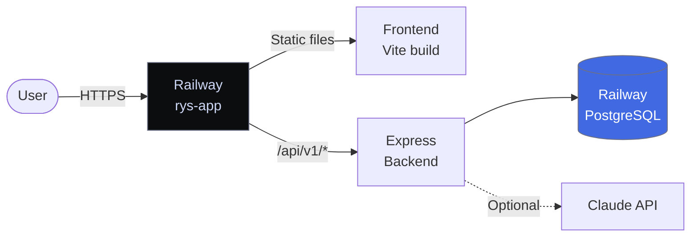

<p align="center">
  
</p>

<h1 align="center">Rys</h1>

<p align="center">
  <strong>Your job search, unified.</strong><br/>
  Track applications, manage resumes, prep for interviews, run a networking CRM,<br/>and get AI-powered insights — all in one workspace.
</p>

<p align="center">
  <a href="#-quick-start"></a>
  <a href="https://rys-app-production.up.railway.app"></a>
</p>

<p align="center">
  
  
  
  
  
  
  
</p>

---

## 📋 Table of Contents

- [Features](#-features)
- [Architecture](#-architecture)
- [Tech Stack](#-tech-stack)
- [Quick Start](#-quick-start)
- [Environment Variables](#-environment-variables)
- [API Reference](#-api-reference)
- [AI Configuration](#-ai-configuration)
- [Deployment](#-deployment)
- [Project Structure](#-project-structure)
- [Scripts](#-scripts)
- [Testing](#-testing)
- [Contributing](#-contributing)
- [License](#-license)

---

## ✨ Features

| Module | Description |
|--------|-------------|
| **Kanban Board** | Drag-and-drop application tracker with 6 stages, grid layout, card detail modals, search, and tag filters |
| **Resume Manager** | Upload multiple PDF versions, tag them, mark a default, and link resumes to specific applications |
| **Interview Prep** | Track rounds per application with type, schedule, outcome, and prep/feedback notes |
| **Networking CRM** | Contact management with relationship types, follow-up flags, and date tracking |
| **AI Tools** | Job analyzer (ATS keywords, skill matching), cover letter generator, and interview coach — powered by Claude |
| **Analytics** | Applications-per-week trends, conversion funnel, response/interview/offer rates via Recharts |
| **Goal Tracker** | Set weekly/monthly targets with live progress bars computed from real application data |
| **Dark Mode** | System-aware theme toggle, persisted per account |
| **Demo Mode** | One-click demo login with pre-seeded data — no signup required |

---

## 🏗 Architecture

### System Overview



### Request Flow



### Authentication Flow



---

## 🔧 Tech Stack

| Layer | Technologies |
|-------|-------------|
| **Frontend** | React 18, Vite 5, TypeScript, Tailwind CSS, Framer Motion, dnd-kit, Radix UI, React Query, Zustand, React Router, Recharts, Lucide Icons |
| **Backend** | Node.js 22, Express 4, TypeScript, Zod, JWT + bcrypt, Multer |
| **Database** | PostgreSQL 16, raw SQL with forward-only migrations |
| **AI** | Anthropic SDK (Claude), deterministic fallback mock mode |
| **Infrastructure** | Docker Compose (dev), Railway (prod), multi-stage Dockerfile |

---

## 🚀 Quick Start

### Prerequisites

- **Docker** (recommended) — or Node.js 22+ and PostgreSQL 13+
- Git

### Option A: Docker (recommended)

```bash
# Clone the repository
git clone https://github.com/me-adityaraj8/rys.git
cd rys

# Create environment files
cp backend/.env.example backend/.env
cp frontend/.env.example frontend/.env

# Start the full stack (Postgres + Backend + Frontend)
docker compose up --build

# In another terminal, run migrations and seed demo data
docker compose exec backend npm run migrate
docker compose exec backend npm run seed
```

### Option B: Local development

```bash
# Backend
cd backend
cp .env.example .env          # Set DATABASE_URL to your local Postgres
npm install
npm run migrate
npm run seed                   # Seeds demo account
npm run dev                    # → http://localhost:4000

# Frontend (new terminal)
cd frontend
cp .env.example .env
npm install
npm run dev                    # → http://localhost:5173
```

### 🔑 Demo Login

After seeding, use the **"Try with demo account"** button on the login page, or:

| Field | Value |
|-------|-------|
| Email | `demo@rys.app` |
| Password | `password123` |

---

## 🔐 Environment Variables

### Backend (`backend/.env`)

| Variable | Required | Default | Description |
|----------|----------|---------|-------------|
| `DATABASE_URL` | Yes | — | PostgreSQL connection string |
| `JWT_SECRET` | Yes | `dev_jwt_secret_change_me` | Secret for signing JWTs |
| `JWT_EXPIRES_IN` | No | `7d` | Token lifetime |
| `ANTHROPIC_API_KEY` | No | — | Anthropic key. Blank = mock mode |
| `ANTHROPIC_MODEL` | No | `claude-opus-4-8` | Claude model ID |
| `CORS_ORIGIN` | No | `http://localhost:5173` | Allowed frontend origin |
| `UPLOAD_DIR` | No | `uploads` | Resume PDF storage directory |
| `PORT` | No | `4000` | Server port |
| `NODE_ENV` | No | `development` | Environment mode |

### Frontend (`frontend/.env`)

| Variable | Required | Default | Description |
|----------|----------|---------|-------------|
| `VITE_API_URL` | No | `http://localhost:4000/api/v1` | Backend API base URL |

---

## 📡 API Reference

All endpoints are prefixed with `/api/v1`. Protected routes require `Authorization: Bearer <token>`.

| Method | Endpoint | Auth | Description |
|--------|----------|------|-------------|
| `GET` | `/health` | No | Health check + AI mode status |
| `POST` | `/auth/register` | No | Create account |
| `POST` | `/auth/login` | No | Authenticate and receive JWT |
| `GET` | `/auth/me` | Yes | Current user profile |
| `PATCH` | `/auth/me` | Yes | Update profile (name, dark mode) |
| `GET` | `/applications` | Yes | List all applications |
| `POST` | `/applications` | Yes | Create application |
| `PATCH` | `/applications/:id` | Yes | Update application |
| `DELETE` | `/applications/:id` | Yes | Delete application |
| `GET` | `/applications/tags` | Yes | Distinct tag list |
| `GET` | `/resumes` | Yes | List resumes |
| `POST` | `/resumes` | Yes | Upload resume PDF |
| `DELETE` | `/resumes/:id` | Yes | Delete resume |
| `GET` | `/interviews` | Yes | List interview rounds |
| `POST` | `/interviews` | Yes | Create interview round |
| `PATCH` | `/interviews/:id` | Yes | Update interview |
| `DELETE` | `/interviews/:id` | Yes | Delete interview |
| `GET` | `/contacts` | Yes | List contacts |
| `POST` | `/contacts` | Yes | Create contact |
| `PATCH` | `/contacts/:id` | Yes | Update contact |
| `DELETE` | `/contacts/:id` | Yes | Delete contact |
| `POST` | `/ai/analyze-job` | Yes | AI job description analysis |
| `POST` | `/ai/cover-letter` | Yes | AI cover letter generation |
| `POST` | `/ai/interview-questions` | Yes | AI interview question generation |
| `GET` | `/analytics/summary` | Yes | Dashboard analytics |
| `GET` | `/goals` | Yes | List goals with live progress |
| `POST` | `/goals` | Yes | Create goal |
| `PATCH` | `/goals/:id` | Yes | Update goal |
| `DELETE` | `/goals/:id` | Yes | Delete goal |

---

## 🤖 AI Configuration

Rys supports two AI modes:

| Mode | When | Behavior |
|------|------|----------|
| **Mock** | `ANTHROPIC_API_KEY` is empty | Returns realistic placeholder responses, labeled as mock in UI. Stored with `is_mock = true`. |
| **Live** | `ANTHROPIC_API_KEY` is set | Real Claude API calls for job analysis, cover letters, and interview prep. |

> **Note:** The resume-match score is always computed deterministically in code (`computeMatchScore`), independent of the AI model.

The `/health` endpoint reports the current mode:

```json
{
  "status": "ok",
  "aiMode": "mock",
  "model": "claude-opus-4-8",
  "time": "2026-07-07T12:00:00.000Z"
}
```

---

## 🚢 Deployment

Rys is deployed on [Railway](https://railway.app) as a single container serving both the API and the static frontend.

### Production Architecture



### Deploy Your Own

1. Fork this repo
2. Create a [Railway](https://railway.app) project
3. Add a **PostgreSQL** database
4. Add a **service** linked to your GitHub repo
5. Set environment variables: `DATABASE_URL` (Railway reference), `JWT_SECRET`, `NODE_ENV=production`
6. Railway auto-deploys on every push to `main`

The root `Dockerfile` handles everything: multi-stage build for frontend (Vite) and backend (TypeScript), migrations run on startup.

---

## 📁 Project Structure

```
rys/
├── Dockerfile                  # Production multi-stage build
├── docker-compose.yml          # Local dev stack
├── backend/
│   ├── migrations/             # Versioned SQL (001_init → 006_missions)
│   └── src/
│       ├── config/             # Environment validation
│       ├── db/                 # Pool, migrate runner, seed
│       ├── routes/             # Express routers (thin)
│       ├── controllers/        # Request/response handling
│       ├── services/           # Business logic (AI, analytics, auth)
│       ├── data/               # Raw SQL queries (data-access layer)
│       ├── validation/         # Zod schemas per feature
│       ├── middleware/         # Auth, validation, error handler
│       └── types/              # Shared domain types
└── frontend/
    └── src/
        ├── components/
        │   ├── ui/             # Base components (shadcn-style)
        │   ├── applications/   # Kanban, cards, detail modal
        │   └── layout/         # Sidebar, AppLayout
        ├── pages/              # Route pages (10 pages)
        ├── stores/             # Zustand (auth, theme, toast)
        ├── hooks/              # React Query hooks per feature
        ├── lib/                # API client, utils, constants
        └── types/              # API types (mirrors backend)
```

---

## 📜 Scripts

### Backend (`cd backend`)

| Command | Description |
|---------|-------------|
| `npm run dev` | Start dev server with hot reload (tsx watch) |
| `npm run build` | Compile TypeScript to `dist/` |
| `npm start` | Run compiled production server |
| `npm run migrate` | Run forward-only SQL migrations |
| `npm run seed` | Seed demo account with sample data |
| `npm test` | Run unit tests (Vitest) |
| `npm run typecheck` | Type-check without emitting |

### Frontend (`cd frontend`)

| Command | Description |
|---------|-------------|
| `npm run dev` | Start Vite dev server with HMR |
| `npm run build` | Production build (type-check + bundle) |
| `npm run preview` | Preview production build locally |
| `npm run typecheck` | Type-check without building |

---

## 🧪 Testing

Backend business logic is unit-tested with **Vitest**:

```bash
cd backend && npm test
```

Covers auth (hashing, JWT, error paths), resume-match scoring, and analytics calculations.

---

## 🤝 Contributing

Contributions are welcome! Here's how to get started:

1. **Fork** the repository
2. **Clone** your fork: `git clone https://github.com/<you>/rys.git`
3. **Create a branch**: `git checkout -b feature/your-feature`
4. **Make changes** and ensure tests pass: `npm test`
5. **Commit** with a descriptive message
6. **Push** and open a Pull Request

### Guidelines

- Follow existing code patterns and naming conventions
- Add tests for new business logic
- Keep PRs focused — one feature or fix per PR
- Run `npm run typecheck` in both `backend/` and `frontend/` before pushing

---

## 📄 License

This project is open source under the [MIT License](LICENSE).

---

<p align="center">
  Built with ☕ and TypeScript
</p>
